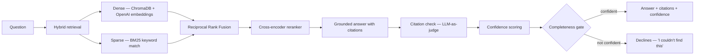

# GitLab Benefits Q&A — a RAG system with hybrid search

A question-answering system over GitLab's public handbook (benefits, leave, time-off, and HR
policies). You ask a question, it retrieves the relevant policy text, writes a grounded answer with
inline citations, checks its own citations, and — importantly — **declines to answer when it isn't
confident** instead of making something up.

I built this to go deeper than a basic "embed some docs and call an LLM" tutorial. The interesting
parts are the retrieval quality, the guardrails against hallucination, and an evaluation harness that
actually drove the design decisions rather than just producing a number at the end.

- **Live demo:** https://rag-dashboard-wcm.streamlit.app/
- **API:** https://rag-api-751441988751.us-central1.run.app (docs at `/docs`)
- **Dashboard code:** https://github.com/CMWENDY/rag-dashboard/tree/main

> The demo runs on free tiers (Cloud Run + Streamlit Community Cloud), so the first request after it's
> been idle takes ~30s to wake up. After that it's quick.

---

## What it actually does

The retrieval is **hybrid** — it doesn't rely on embeddings alone. Handbook docs are full of exact
terms (dollar amounts, provider names, section titles) that pure semantic search tends to fumble, so
I combine two methods and rerank the result:



Step by step:

1. **Dense search** (ChromaDB + OpenAI embeddings) finds semantically similar chunks.
2. **Sparse search** (BM25) catches exact keyword matches the embeddings miss.
3. The two rankings are merged with **Reciprocal Rank Fusion**, then a **cross-encoder reranker**
   (`ms-marco-MiniLM-L-6-v2`) re-scores the top candidates against the full question and pulls the
   best chunk to the top.
4. The LLM writes an answer **grounded in those chunks, with `[n]` citations**.
5. Every citation is **verified** against its source chunk by a second LLM call ("does chunk 3
   actually support this sentence?").
6. Each answer gets a **confidence score** (retrieval strength, citation coverage, answer
   completeness), and a **post-generation completeness gate** makes the system decline rather than
   guess when the answer doesn't actually address the question.

It also indexes documents **three different ways** (fixed-size, structure-aware, and semantic
chunking) and lets you compare them — which mattered, because the evaluation showed they're not
equal (see below).

## Tech stack

- **Python**, **FastAPI** + **uvicorn** (the API), **Streamlit** (the dashboard)
- **ChromaDB** for vector search, **rank_bm25** for keyword search, **sentence-transformers** for the
  cross-encoder reranker
- **OpenAI** for embeddings, answer generation, and the LLM-as-judge steps
- **Docker** / docker-compose for local orchestration
- Deployed with the API on **Google Cloud Run** and the dashboard on **Streamlit Community Cloud**

## The API

| Method & path | What it does |
|---|---|
| `POST /v1/ask` | Full pipeline: retrieve → answer → verify → score → (maybe) decline |
| `POST /v1/retrieve` | Just retrieval; supports `mode: hybrid` or `dense` for side-by-side comparison |
| `GET /v1/documents` | Lists the indexed documents, their entity tags, and chunk counts |
| `POST /v1/ingest` | Adds a new document to the index (API-key protected) |

Interactive docs are auto-generated at `/docs`.

## Results

I wrote a **63-question golden dataset** (lookups, multi-hop questions, ambiguous ones, and questions
that are deliberately unanswerable) and scored the system against the **full corpus — all ~87
handbook documents**, not the smaller demo subset. Numbers below are for the default `structure`
chunking strategy:

| Metric | Score | Meaning |
|---|---|---|
| Faithfulness | **1.00** | no answer made a claim the sources didn't support |
| Citation accuracy | **~0.96** | citations actually backed up their sentence |
| Retrieval coverage | **0.97** | the right chunk was retrieved almost every time |
| No-answer decline rate | **0.90** | it correctly refused 9 of 10 unanswerable questions |
| Answer correctness | **0.86** | vs. hand-written answers (LLM-judged) |

Broken down by question type, correctness was **0.96 on lookups**, **0.85 on multi-hop**, and
**0.44 on ambiguous** questions — that last one is the clear weak spot (more on that below).

### Choosing a chunking strategy with data

I ran the same eval three times, once per chunking strategy, and let the numbers pick the default:

| Metric | fixed | **structure** | semantic |
|---|---|---|---|
| Answer correctness | 0.840 | **0.858** | 0.717 |
| No-answer decline | 0.800 | **0.900** | 0.800 |
| Retrieval hit rate | 1.000 | **1.000** | 0.933 |
| Retrieval coverage | 0.920 | **0.967** | 0.737 |
| Faithfulness | 0.988 | **1.000** | 0.996 |
| Citation accuracy | 0.947 | **0.958** | 0.860 |

`structure` (splitting on markdown headings, so each section stays whole) won or tied on every metric,
so that's what the system serves. `semantic` chunking looked clever but fragmented answers into ~18k
tiny pieces and tanked its retrieval coverage. All three strategies stay in the index; the eval is
what chose the winner.

### Two things the eval caught (that I wouldn't have otherwise)

- **The answer chunk was sometimes just past the cutoff.** The dental-benefits section kept landing at
  rank 11 while I was retrieving the top 10. Measuring recall is what surfaced it — bumping `top_k` to
  15 recovered those answers.
- **My confidence gate was backwards.** The original gate used *retrieval* confidence, but
  unanswerable questions often scored *higher* on it than real ones, so it almost never declined
  (decline rate ~0.1). Switching to a **post-generation completeness gate** — judging whether the
  answer actually addressed the question — brought the decline rate up to 0.90 and stopped it from
  refusing real questions.

## Running it locally

You'll need Docker and an OpenAI API key.

```bash
# 1. put your key in a .env file
echo "OPENAI_API_KEY=sk-..." > .env
echo "DEMO_KEY=any-random-string" >> .env   # gates the ingest endpoint

# 2. build the search index from the sample docs
python seed.py

# 3. bring up ChromaDB, the API, and the dashboard
docker compose up --build
```

Then open the dashboard at `http://localhost:8501` and the API docs at `http://localhost:8000/docs`.

(If you'd rather run the pieces directly without Docker: `python seed.py` to build the index, then
`uvicorn api:app --reload` and `streamlit run dashboard.py` in separate terminals.)

## Project structure

```
loader.py        raw docs (md/pdf/html) -> documents.json
chunker.py       three chunking strategies -> chunks.json
store.py         builds the ChromaDB collection + BM25 index
retriever.py     hybrid search: dense + BM25 + RRF + cross-encoder rerank
generator.py     grounded answer generation with citations
verifier.py      LLM-as-judge citation checking
scorer.py        confidence scoring (retrieval / citations / completeness)
pipeline.py      ties it together + the completeness gate
api.py           FastAPI service
dashboard.py     Streamlit UI
seed.py          one-shot: build the index from sample_docs/
eval/            golden dataset + evaluation, strategy comparison, calibration
docs/            raw corpus + the built indexes
notes/           my working notes for each phase
```

## Corpus

The documents are from GitLab's public handbook — their benefits, leave, time-off, and policy pages.
They're a good fit because they're **specific** (dollar figures, per-country entity benefits, exact
policy names), which is exactly where hybrid search earns its keep over embeddings alone.

The **full corpus is ~87 files**, and that's what the evaluation numbers above are measured on. The
**hosted demo runs on a curated 25-file subset** — focused on benefits (the general policy plus the
per-country entity benefits for the US, UK, Canada, Ireland, France, and more), leave and time-off,
and US/entity HR policy. I picked those files so the demo questions have strong coverage and so you
can actually watch hybrid search and entity filtering do their thing — for example, comparing what a
US employee gets versus a UK one. The full 87-file corpus is in the repo if you want to index all of
it.

## Limitations and what I'd do next

I'd rather be honest about the rough edges than oversell this.

- **Ambiguous questions are the weak spot (0.44).** When a question is underspecified, the system
  commits to one interpretation and answers that instead of asking for clarification. The fix I'd
  build is **query clarification / self-querying** — detect the ambiguity and either ask a follow-up
  or answer the plausible interpretations separately.
- **Multi-hop questions could go further with query decomposition (0.85 today).** Right now a question
  that needs two separate facts is handled in a single retrieval pass, which works surprisingly often
  but isn't robust. The next real improvement is a **query-decomposition step**: break a complex
  question into sub-questions, retrieve for each one independently, then compose the final answer from
  all of them. That's the biggest planned piece of work.
- **Ingest doesn't scale or survive crashes.** BM25 rebuilds the whole index on every add (fine for
  this size, slow at scale), the write isn't transactional, and there's no lock for concurrent
  ingests. A production version would use a search backend with incremental updates and atomic writes.
- **The hosted demo is effectively read-only.** Cloud Run's filesystem is ephemeral, so anything added
  through `/v1/ingest` on the live demo disappears on the next restart. Ingest really lives in the
  local/Docker setup.
- **The reranker is heavy.** torch + the cross-encoder are what make cold starts slow on a free tier.
  A lighter reranker (or caching) would help if this ever needed to be snappy from cold.

